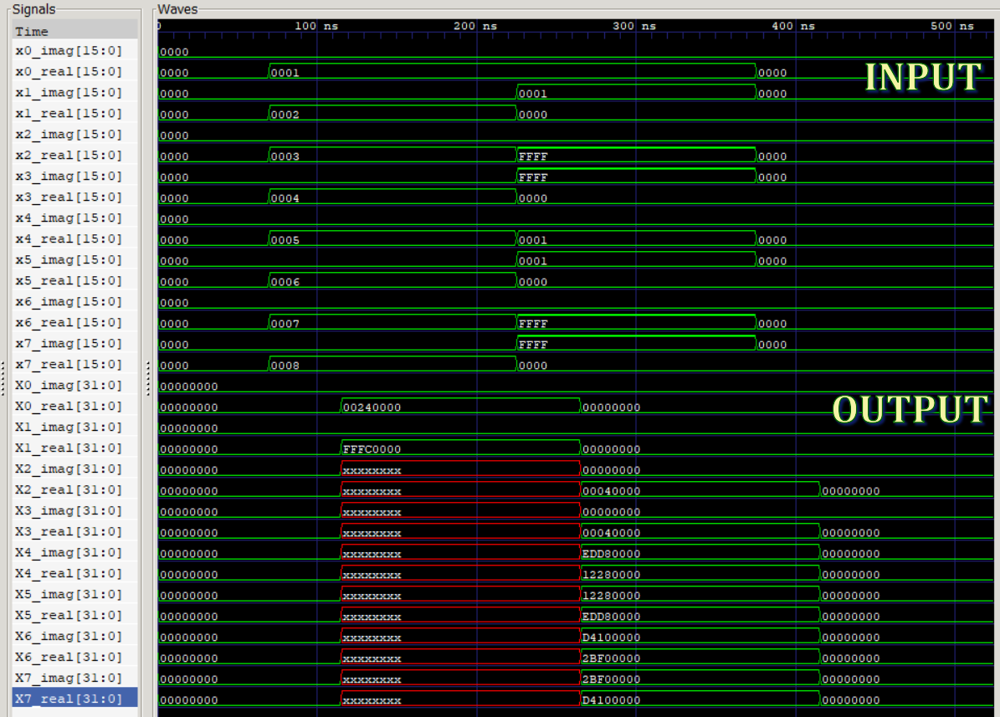

# 8-Point FFT Accelerator Simulation

This project demonstrates an **8-point Fast Fourier Transform (FFT) accelerator** implemented and simulated using **Icarus Verilog**.

## Project Structure
- [**fft8.v**](fft8_test/fft8.v): Verilog source code for the 8-point FFT module.
- [**fft8_tb.v**](fft8_test/fft8_tb.v): Testbench for simulating the FFT module.
- [**fft8_test**](fft8_test/fft8_test): Output or log file from the simulation.
- [**plots.png**](fft8_test/plots.png): Visualization of FFT results (e.g., input/output waveforms or spectra).
- [**test.vcd**](fft8_test/test.vcd): Value Change Dump file for waveform analysis.


## How to Run the Simulation

1. **Install Icarus Verilog** (if not already installed).
2. **Compile the design and testbench:**

```sh
iverilog -o fft8_test fft8.v fft8_tb.v
```

3. **Run the simulation:**

```sh
vvp fft8_test
```

4. **View waveforms** (optional, using GTKWave):

```sh
gtkwave test.vcd
```


## Output

- The simulation produces a VCD file ([`test.vcd`](fft8_test/test.vcd)) for waveform inspection.
- The [`plots.png`](fft8_test/plots.png) file provides a visual summary of the FFT results.




## Notes

- The design and testbench are modular and easy to modify for different FFT sizes.
- For further analysis, inspect the VCD file or refer to the generated plots.
